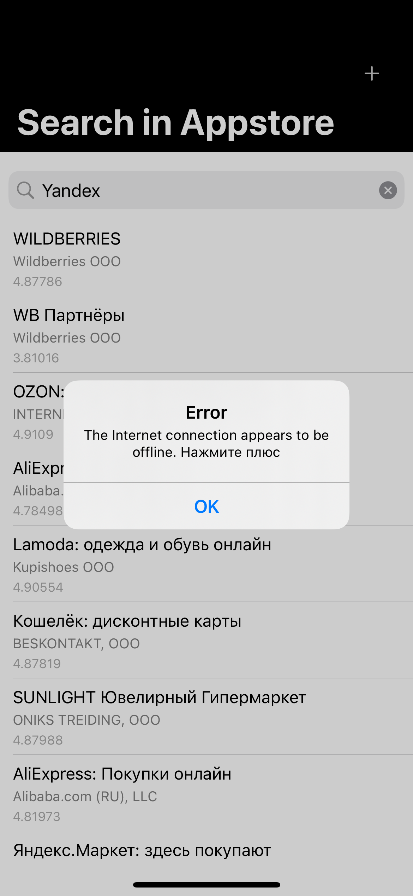
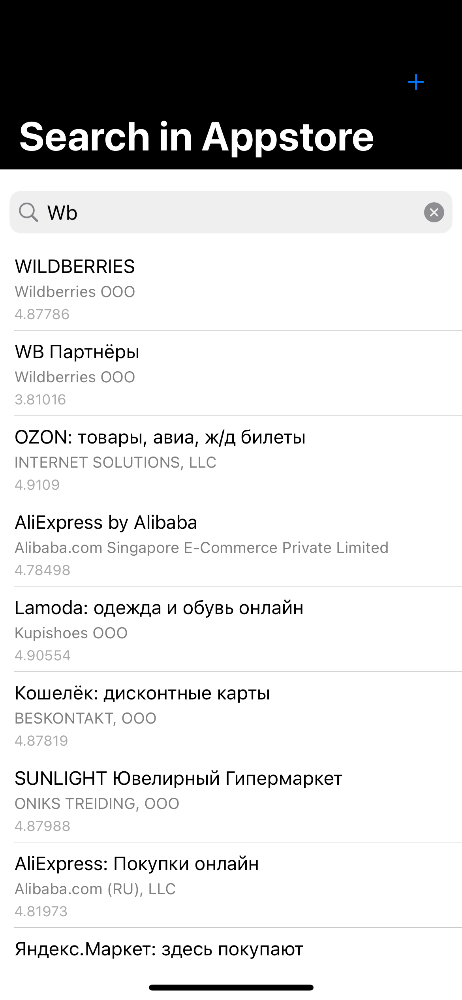
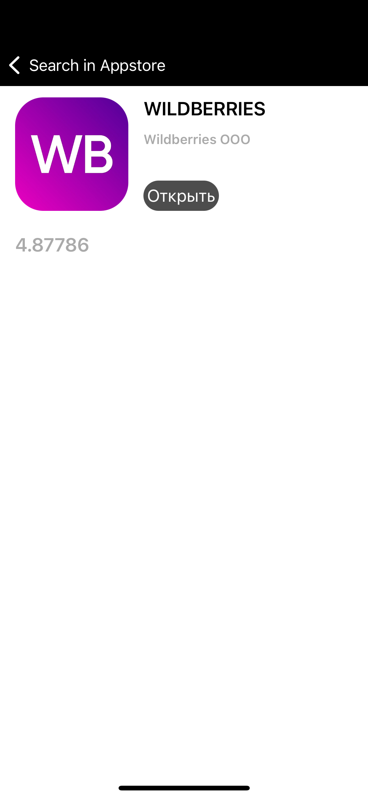

# MyTestTask
Архитектура MVP. Проект без сторибордов. Первый экран - таблица, второй - parent UIViewController, на который добавлен чайлд, отображающий детали из таблицы.
 Для запросов в сеть используется Alamofire. Обрабатываются сетевые ошибки.
 Последний результат поискового запроса сохраняется автоматически при помощи FileManager.
 Отобразить сохраненный запрос можно, нажав на плюс. 
 
         
 
